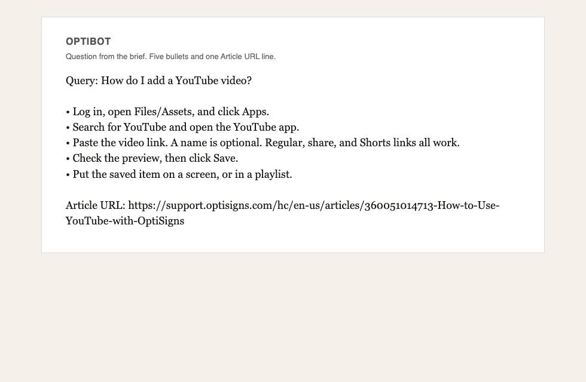

# Knowledge base sync

Pulls public help-center articles into Markdown and uploads only new or changed files to an OpenAI vector store. One run, then the process exits.

## Setup

```bash
python3 -m venv .venv && source .venv/bin/activate
pip install -r requirements.txt
pip install -r requirements-dev.txt   # pytest only
cp .env.sample .env   # set OPENAI_API_KEY or API_KEY
```

## Run

```bash
python main.py
docker build -t kb-sync-agent .
docker run --rm -e API_KEY=sk-... kb-sync-agent
```

`API_KEY` and `OPENAI_API_KEY` are the same setting. The container runs `main.py` once and exits 0.

## What the job does

1. Read articles from the Zendesk help-center API (at least 30) and save `<slug>-<id>.md`. The id is in the name so two articles with the same title do not overwrite one file. Nav and scripts are dropped. Headings, links, and code stay. Each file starts with `Article URL:`.
2. Compare SHA-256 of the file and Zendesk `updated_at` with the last run. Counts printed: added, updated, skipped.
3. Upload the delta with the OpenAI vector-store file-batch API. Files already in the store with the same `content_hash` attribute are not sent again, including from a clean container. A rate limit waits and retries. The old copy is removed only after the new batch succeeds.
4. Ask "How do I add a YouTube video?" with the file_search tool and the system prompt from the brief.

Chunking is static: 800 tokens, 100 overlap, set on each uploaded file. A short how-to fits in one chunk. The overlap keeps a step that lands on a boundary.

First successful upload: **35 files**, about **138 chunks** by the local estimate. OpenAI chunks each file itself with the same 800/100 settings. Every run also prints that local estimate for all scraped files, plus the remote store's completed file count, even when this run embeds nothing.

A later run on a machine that already has state prints added 0, updated 0, skipped 35. A fresh machine has no state file, so the same articles show up as added. The upload still skips them when the store already has the same content hash. The public run did that: added 35, embedded 0, 35 files left in the store.

## Daily job

GitHub Actions runs `python main.py` every day at 00:00 UTC.

Latest run of this pipeline: https://github.com/ducnmm/kb-sync-agent/actions/runs/36359689930

## Sample answer



The program keeps at most five of the model's top-level steps and writes the support article it cited as one `Article URL:` line. Nested bullets are dropped. A reply with no support article fails the run.
